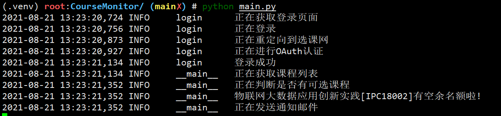

## 选课状态监测

### 功能说明
该程序的目的是帮助同学及时捡课，它可以监测选课网中指定课程的状态，如果这些课程有剩余名额则立即发送邮件通知。


### 基本使用
#### step1: 配置Python环境

```bash
python3 -m venv .venv            # 创建一个虚拟环境
source .venv/bin/activate       # 激活虚拟环境
pip install -r requirements.txt # 安装依赖
```

#### step2: 编辑配置文件`config.json`，完善基本信息

```
{
    "username": "xxxxxx",           // 统一身份认证号或学号
    "password": "xxxxxx",           // 教务网登录密码
    "courseCode": [                 // 想要监测的课程号
        "IPC18004",
        "IPC18003",
        "IPC18002"
    ],
    "interval": 300,                // 查询间隔时间(单位秒)
    "sendEmail": "aaaa@qq.com",     // 发送通知的邮箱,以qq邮箱为例
    "sendEmailPassword": "xxxxxxxx",// 发送通知的邮箱密码(登录授权码) 
    "smtpHost": "smtp.qq.com",      // SMTP服务器地址,以qq邮箱为例
    "receiveEmail": "bbbb@gmail.com"// 接收通知的邮箱,以gmail为例
}
```

#### step3: 启动脚本

```bash
python3 ./main.py
```

也可以使用`nohup`使其在后台运行
```bash
nohup python ./main.py > ./course-monitor.log 2>&1 &
```
